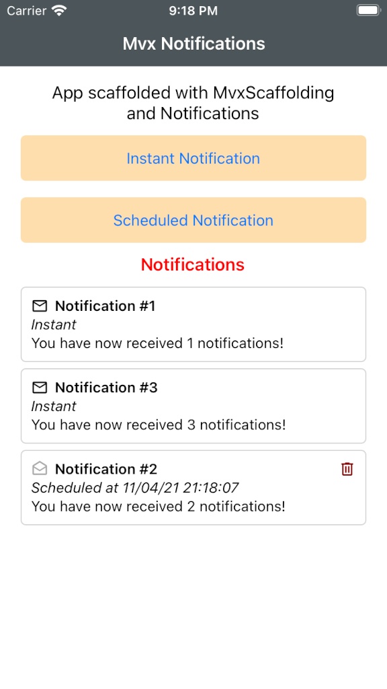
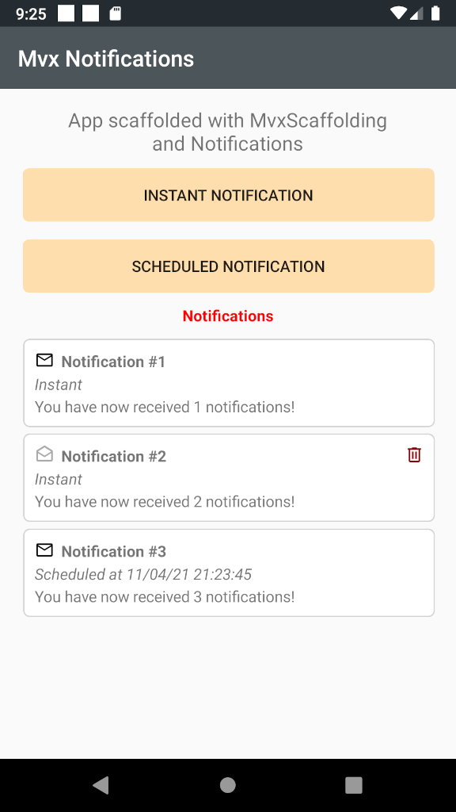

# Xamarin.Forms (iOS+Android) MvvmCross scaffolding with basic notifications management

I started this project to learn:

* How to use MvvmCross scaffolding 
* How to manage notifications 
* How to handle ViewModel <-> View interaction
* How to handle View <-> ViewModel interaction
* How to use MaterialDesignFont as Icons

## Screenshots 

{:height="50%" width="50%"}
{:height="50%" width="50%"}

## Credits 

[Xamarin](https://dotnet.microsoft.com/apps/xamarin)

[MvvmCross](https://www.mvvmcross.com/)

[James Montamagno - Using Font Icons in Xamarin.Forms: Goodbye Images, Hello Fonts!](https://montemagno.com/using-font-icons-in-xamarin-forms-goodbye-images-hello-fonts/)

[Andrei Nitescu - Icon Font to #Code](https://andreinitescu.github.io/IconFont2Code/)

[Matarial Design Icons](https://materialdesignicons.com/)

## Project steps 

### Mvvm scaffolding 

_Apr 10th 2021_

If the MvvmCross templates are not yet installed:
```sh 
dotnet new --install MvxScaffolding.Templates
```

Creation of the new project:
```sh 
dotnet new mvxforms --name MvxNotifications --solution-name MvxNotifications
```

### Project update and improvements

_Apr 10th 2021_

* Move Texts and Command to HomeViewModel
* Update to Xamarin.Forms 5.0.0.2012

### Add NotificationService

_Apr 10th 2021_

Added `INotiricationService`

```cs
public class NotificationInfo
{
    public int Id { get; set; }
    public string Title { get; set; }
    public string SubTitle { get; set; }
    public string Message { get; set; }
}

public interface INotificationService
{
    // publischer
    void Publish(NotificationInfo notificationInfo, DateTime? notifyTime = null);

    // listener
    event EventHandler<NotificationInfo> OnNotificationReceived;
    event EventHandler<NotificationInfo> OnNotificationOpened;
    void NotificationReceived(NotificationInfo notificationInfo);
    void NotificationOpened(NotificationInfo notificationInfo);
}
```

### Handles VewModel -> View inreraction with events

_Apr 10th 2021_

```cs
public abstract class BaseViewModel : MvxViewModel
{
    public EventHandler<DisplayAlertEventArgs> DisplayAlert;
    public EventHandler<DisplayQuestionEventArgs> DisplayQuestion;
}
```

### Handles VewModel <-> View inreraction with __IMvxInteraction__

_Apr 11th 2021_

Implemented View <-> ViewModel interaction using `IMvxInteraction<YesNoQuestion>`


### Using MatarialDesignFont (embedded) as icons

_Apr 11th 2021_

Include `materialdesignicons-webfont.ttf` as embedded resource to use MaterialDesignFonts as icons.

**Add files**

* MxvNotifications.UI\Resources\Fonts\materialdesignicons-webfont.ttf
* MxvNotifications.UI\Resources\Fonts\MaterialDesignIconCodes.xaml
* MxvNotifications.UI\Resources\Fonts\MaterialDesignIconCodes.xaml.cs

Add file `AssemblyInfo.cs`

```cs
using Xamarin.Forms;
using Xamarin.Forms.Xaml;

[assembly: XamlCompilation(XamlCompilationOptions.Compile)]
[assembly: ExportFont("materialdesignicons-webfont.ttf", Alias = "MaterialDesignIcons")]
```

Add the following lines to file: `App.xaml`

`xmlns:mdifonts="clr-namespace:MvxNotifications.UI.Resources.Fonts"`

`<mdifonts:MaterialDesignIconCodes />`

```xml
<?xml version="1.0" encoding="utf-8" ?>
<Application
    x:Class="MvxNotifications.UI.App"
    xmlns="http://xamarin.com/schemas/2014/forms"
    xmlns:x="http://schemas.microsoft.com/winfx/2009/xaml"
    xmlns:d="clr-namespace:MvvmCross.Forms;assembly=MvvmCross.Forms"
    xmlns:resources="clr-namespace:MvxNotifications.UI.Resources"
    xmlns:mdifonts="clr-namespace:MvxNotifications.UI.Resources.Fonts">
    <Application.Resources>

        <!--  Application resource dictionary  -->
        <ResourceDictionary>
            <ResourceDictionary.MergedDictionaries>
                <resources:Colors />
                <mdifonts:MaterialDesignIconCodes />
            </ResourceDictionary.MergedDictionaries>
        </ResourceDictionary>

    </Application.Resources>
</Application>
```

Xaml example:

```xml
<Image
    IsVisible="{Binding IsRead}"
    HorizontalOptions="Start"
    VerticalOptions="CenterAndExpand">
    <Image.Source>
        <FontImageSource
            Color="DarkGray"
            FontFamily="MaterialDesignIcons"
            Glyph="{StaticResource MDI.EmailOpenOutline}"
            Size="Default" />
    </Image.Source>
</Image>
```